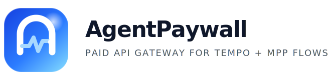

<p align="center">
  
</p>

# AgentPaywall

AgentPaywall turns an API into a **seller-owned paid endpoint**. Providers create a route, attach a Tempo wallet, and share a stable gateway URL. Agents can call that endpoint, satisfy an **MPP payment challenge**, retry, and receive the result only after payment verification.

Using this any existing api can be turned into agentic APIs.

## Demo Video

[](https://youtu.be/XP0RncUUWUI)

- A **seller dashboard** for registering providers and publishing paid proxy routes
- A **buyer / agent demo flow** that provisions and funds a Tempo testnet wallet, then invokes a paid route end to end

## Why we built this

Most API monetization still assumes humans, subscriptions, dashboards, and pre-funded accounts. Agents do not work that way. They need:

- a machine-readable price
- a machine-readable payment challenge
- a way to retry automatically after settlement
- proof that execution happened only after payment

## Tech Stack

- `mppx`
- `Tempo testnet`
- `Next.js 16`
- `TypeScript`

## Local Setup

```bash
npm install
cp .env.example .env.local
npm run dev
```

Open [http://localhost:3000](http://localhost:3000).

## Environment Variables

Example `.env.local`:

```env
PAYMENTS_PROVIDER=mock
NEXT_PUBLIC_PAYMENTS_PROVIDER=mock
STRIPE_SECRET_KEY=
MPP_SECRET_KEY=
SESSION_SECRET=
DATABASE_URL=
APP_BASE_URL=http://localhost:3000
ADMIN_TOKEN=
```

## Verification

```bash
npm run typecheck
npm run test
npm run build
```

## What’s Next

This version already demonstrates the core value: agents can pay per call, retry, and unlock results through an MPP-aware gateway. Natural next steps are:

- productionizing seller auth and operational tooling
- expanding external proxy support and upstream observability
- strengthening Tempo testnet and wallet lifecycle flows
- improving deployment ergonomics for real provider onboarding
